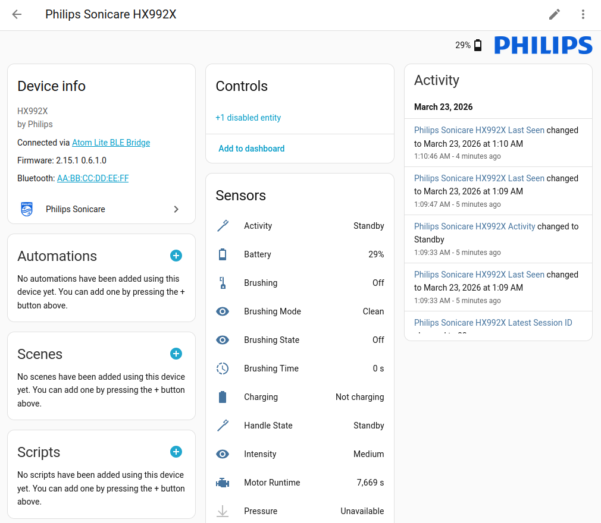
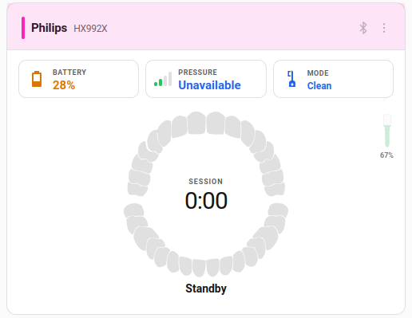
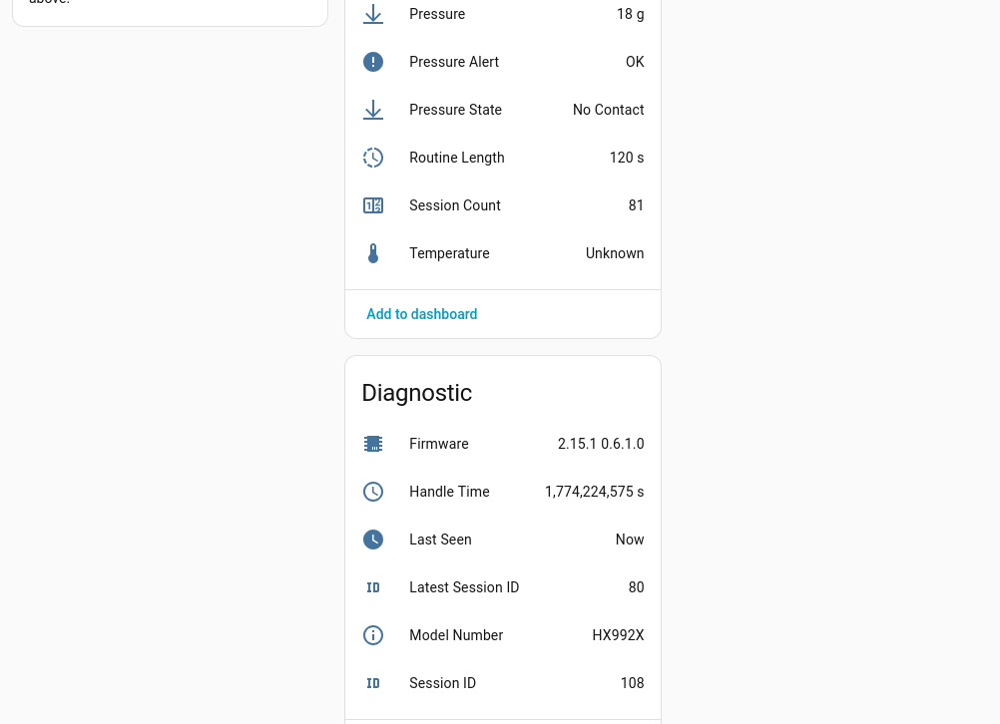
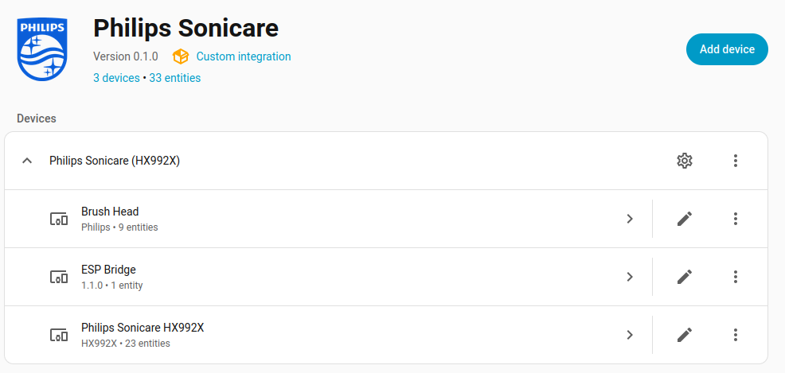
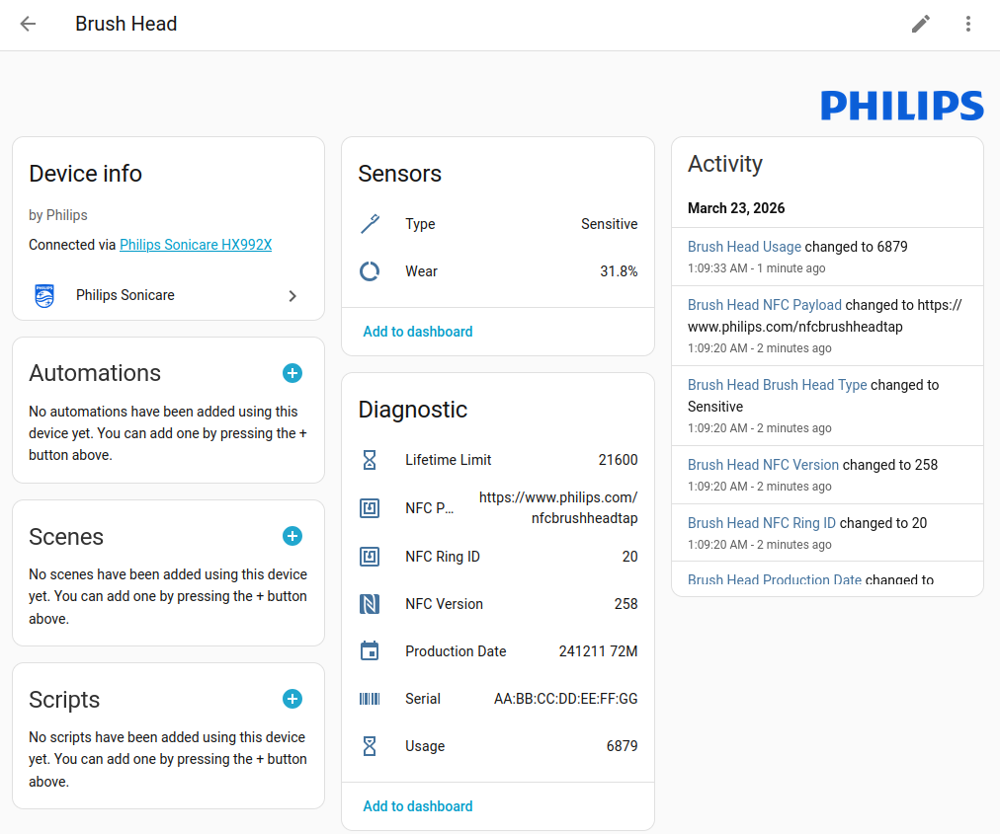

# Philips Sonicare BLE Integration for Home Assistant

[](https://github.com/hacs/integration)
[](https://github.com/mtheli/philips_sonicare_ble/releases)
[](LICENSE)

This is a custom component for Home Assistant to integrate **Philips Sonicare BLE toothbrushes**.

The integration connects to your toothbrush via **Bluetooth Low Energy (BLE)** to provide battery status, brushing session data, brush head wear tracking, and more. All communication is fully local -- no cloud, no app required.



Two connection methods are supported:

1.  **Direct Bluetooth** -- connects from the HA host's Bluetooth adapter (built-in or USB). Uses a persistent live connection with a poll fallback.
2.  **ESP32 BLE Bridge** -- an ESP32 running a custom ESPHome component acts as a wireless BLE relay. Ideal when the toothbrush is out of Bluetooth range of the HA host.

See [Configuration](#configuration) for setup instructions.

---

## Table of Contents

- [Tested Models](#tested-models)
- [Dashboard Card](#dashboard-card)
- [Features](#features)
- [Prerequisites](#prerequisites)
- [Installation](#installation)
- [Configuration](#configuration)
  - [Option A: Direct Bluetooth](#option-a-direct-bluetooth)
  - [Option B: ESP32 BLE Bridge](#option-b-esp32-ble-bridge)
- [How It Works](#how-it-works)
- [Troubleshooting & Caveats](#troubleshooting--caveats)
- [BLE Protocol](#ble-protocol)
- [Screenshots](#screenshots)

---

## Tested Models

| Family | Model | Direct BLE | ESP32 Bridge | Tested by |
| :--- | :--- | :---: | :---: | :--- |
| **DiamondClean Smart** | [HX992X](https://www.usa.philips.com/c-p/HX9903_11/sonicare-diamondclean-smart-9300-sonic-electric-toothbrush-with-app) | :white_check_mark: | :white_check_mark: | Maintainer |
| **DiamondClean 9000** | [HX991M](https://www.usa.philips.com/c-p/HX9911_91/9000-series-sonic-electric-toothbrush) | :white_check_mark: | — | Community ([forum](http://community-smarthome.com/t/philips-sonicare-ble-zahnbuerste-in-home-assistant-mit-echtzeit-sensoren/10555/17)) |
| **ExpertClean** | [HX962V](https://www.usa.philips.com/c-m-pe/dental-professionals/products/tooth-brushes/expertclean) | — | :white_check_mark: | Community ([#1](https://github.com/mtheli/philips_sonicare_ble/issues/1)) |
| **Prestige 9900** | [HX999X](https://www.usa.philips.com/c-p/HX9990_11/sonicare-9900-prestige-power-toothbrush-with-senseiq) | :white_check_mark: | :white_check_mark: | Maintainer, Community ([forum](https://community.home-assistant.io/t/philips-sonicare-ble-toothbrush-integration-with-30-sensors/999515/5)) |
| **Sonicare For Kids** | [HX6340](https://www.usa.philips.com/c-p/HX6351_41/sonicare-for-kids-sonic-electric-toothbrush) | :white_check_mark: | :white_check_mark: | Maintainer |
| **Sonicare For Kids** | HX6322, HX6352 | :white_check_mark: | — | Community ([GrumpyMeow#14](https://github.com/GrumpyMeow/sonicare-ble-hacs/issues/14#issuecomment-4258415247)) |
| | | | | |
| **FlexCare Platinum Connected** | HX9120 | *not yet tested* | *not yet tested* | — |
| **Series 5300–6700** | HX741X | *different BLE protocol* | *different BLE protocol* | — |
| **Series 7100–7400** | HX742X | *different BLE protocol* | *different BLE protocol* | — |

Any BLE-enabled Philips Sonicare toothbrush using the standard protocol should work (DiamondClean Smart, ExpertClean, 9900 Prestige, For Kids, and more). The Series 5300–7400 (HX74xx) use a newer BLE protocol that is not yet supported. The integration auto-discovers compatible devices via BLE. If you have a different model — happy to hear your test results!

> [!NOTE]
> Some models (ExpertClean, HX991M, Prestige 9900) require **BLE bonding**. The integration detects this automatically and pairs the device during setup. Models like DiamondClean Smart and Sonicare For Kids use open GATT and connect without pairing.

---

## Dashboard Card

For a visual brushing dashboard, use the [**Toothbrush Card**](https://github.com/mtheli/toothbrush-card) -- a custom Lovelace card with live sector tracking, pressure display, and brush head wear indicator. Works with both Philips Sonicare and Oral-B toothbrushes.



---

## Features

This integration creates a new device for your toothbrush and provides the following entities based on your device's hardware:

### Main Status
| Entity | Type | Description |
| :--- | :--- | :--- |
| **Handle State** | Sensor | Current state (`Off`, `Standby`, `Running`, `Charging`, `Shutdown`). |
| **Activity** | Sensor | Composite state derived from handle + brushing state (`Off`, `Standby`, `Brushing`, `Paused`, `Charging`). |
| **Brushing State** | Sensor | Detailed brushing status (`Off`, `On`, `Pause`, `Session Complete`, `Session Aborted`). |
| **Brushing Mode** | Sensor | Active cleaning mode (`Clean`, `White+`, `Gum Health`, `Deep Clean+`, `Sensitive`, `Tongue Care`). |
| **Intensity** | Sensor | Current intensity level (`Low`, `Medium`, `High`). |
| **Battery Level** | Sensor | Battery charge level (`%`). |
| **Brushing** | Binary Sensor | Indicates if actively brushing. |
| **Charging** | Binary Sensor | Indicates if currently charging. |
| **Pressure Alert** | Binary Sensor | Indicates if too much pressure is applied (during brushing). |

### Controls
| Entity | Type | Description |
| :--- | :--- | :--- |
| **Brushing Mode** | Select | Set the brushing mode for the next session. Shows only modes available on your device. **Disabled by default** -- see [Known Issues](#known-issues). |

### Sensor Data (live during brushing)

These sensors are only available while actively brushing and stream live data from the toothbrush IMU.

| Entity | Type | Description |
| :--- | :--- | :--- |
| **Pressure** | Sensor | Brushing pressure force (`g`). |
| **Pressure State** | Sensor | Pressure classification (`No Contact`, `Optimal`, `Too High`). |
| **Temperature** | Sensor | Handle temperature (`°C`). |

### Brushing Session
| Entity | Type | Description |
| :--- | :--- | :--- |
| **Brushing Time** | Sensor | Current session brushing time (seconds). |
| **Routine Length** | Sensor | Target brushing duration (typically 120s). |
| **Session ID** | Sensor | Current brushing session identifier. |
| **Latest Session ID** | Sensor | Most recently completed session identifier. |
| **Session Count** | Sensor | Total number of stored sessions. |

### Brush Head
| Entity | Type | Description |
| :--- | :--- | :--- |
| **Brush Head Wear** | Sensor | Brush head wear level (`%`, computed from usage/lifetime limit). |
| **Brush Head Usage** | Sensor | Accumulated brush head usage counter. |
| **Brush Head Limit** | Sensor | Maximum brush head lifetime. |
| **Brush Head Type** | Sensor | Brush head type (`Adaptive Clean`, `Adaptive White`, `Tongue Care`, `Adaptive Gums`, `Sensitive`). |
| **Brush Head Serial** | Sensor | Brush head serial number (from NFC tag). |
| **Brush Head Date** | Sensor | Brush head manufacturing date. |
| **Brush Head Ring ID** | Sensor | Color ring identifier (for family brush head tracking). |
| **Brush Head NFC Version** | Sensor | NFC chip version on the brush head. |
| **Brush Head Payload** | Sensor | Raw NFC payload data (hex). |

### Diagnostics
| Entity | Type | Description |
| :--- | :--- | :--- |
| **Motor Runtime** | Sensor | Cumulative motor runtime (seconds). |
| **Handle Time** | Sensor | Total handle operating time since manufacture (seconds). |
| **Model Number** | Sensor | Device model number (e.g., HX992B). |
| **Firmware** | Sensor | Installed firmware version. |
| **Last Seen** | Sensor | Timestamp of last successful data read. |
| **RSSI** | Sensor | BLE signal strength in dBm (Direct BLE only). |
| **Bridge Version** | Sensor | ESP bridge firmware version (ESP Bridge only). |

---

## Prerequisites

* A compatible Philips Sonicare toothbrush (see [Tested Models](#tested-models) above).
* **Either** a Home Assistant instance with the **Bluetooth integration** enabled and a working Bluetooth adapter, **or** an ESP32 running the [BLE Bridge component](docs/ESP32_BRIDGE.md).
* **Pairing depends on the model** -- DiamondClean Smart (HX992X) uses open GATT without bonding. ExpertClean (HX962X), Prestige 9900 (HX999X), and HX991M require BLE pairing. The integration handles both cases automatically. Simply close any Sonicare phone app to free the BLE connection.

> [!NOTE]
> The toothbrush only advertises via BLE for a short time after being picked up from the charger or turned on/off. It enters deep sleep after approximately 20 seconds of inactivity. While on the charging stand, it is **not reachable** via BLE.

---

## Installation

### HACS (Recommended)

> Don't have HACS yet? Follow the [HACS installation guide](https://hacs.xyz/docs/use/) first.

1.  Go to **HACS** > **Integrations** in your Home Assistant UI.
2.  Click the three-dot menu in the top right and select **Custom repositories**.
3.  Add `https://github.com/mtheli/philips_sonicare_ble` and select the category **Integration**.
4.  Find the "Philips Sonicare" integration and click **Install**.
5.  Restart Home Assistant.

### Manual Installation

1.  Copy the `custom_components/philips_sonicare_ble` directory from this repository into your Home Assistant `config/custom_components/` folder.
2.  Restart Home Assistant.

---

## Configuration

The integration supports two connection methods:

| | Method | Best for |
| :--- | :--- | :--- |
| **[Option A](#option-a-direct-bluetooth)** | **Direct Bluetooth** | HA host is within Bluetooth range of the toothbrush (typically 5-10 m / 15-30 ft, less through walls) |
| **[Option B](#option-b-esp32-ble-bridge)** | **ESP32 BLE Bridge** | Toothbrush is out of range -- a small ESP32 device placed near the toothbrush relays data over WiFi |

> [!IMPORTANT]
> The standard ESPHome `bluetooth_proxy` crashes the ESP32 during GATT service
> discovery due to an [ESP-IDF bug](https://github.com/esphome/esphome/issues/15783).
> A [workaround](docs/KNOWN_ISSUES.md#workaround) is available that patches the
> bug at build time, or use the dedicated
> [ESP32 BLE Bridge](docs/ESP32_BRIDGE.md) without `bluetooth_proxy`.

### Option A: Direct Bluetooth

1.  Wake up your toothbrush (pick it up from the charger or briefly turn it on).
2.  Navigate to **Settings > Devices & Services**.
3.  The toothbrush should appear under **Discovered** -- click **Configure**.
    - If not discovered automatically, click **+ Add Integration**, search for "**Philips Sonicare**", and enter the MAC address manually.
4.  The confirmation dialog shows the current brush status and detected services. Make sure the toothbrush is **turned on** (status shows "Active") before clicking **Submit**.

> [!TIP]
> Some models (ExpertClean, HX991M) require BLE bonding -- the integration detects this automatically and pairs the device during setup via D-Bus. If auto-pairing is not available (e.g. HAOS without D-Bus), manual pairing instructions are shown. Simply close the Sonicare phone app to free the BLE connection.

### Option B: ESP32 BLE Bridge

If your Home Assistant host is too far from the toothbrush for a direct Bluetooth connection, you can use an [ESP32](https://esphome.io/components/esp32.html) as a wireless BLE bridge. The ESP32 connects to the toothbrush and relays data to HA over WiFi.

This is **not** a standard ESPHome Bluetooth Proxy -- it is a dedicated component that manages the BLE connection directly on the ESP32 and provides full read/write/subscribe access to all GATT characteristics.

> [!NOTE]
> This option requires basic [ESPHome](https://esphome.io/) knowledge (flashing firmware, editing YAML configs). If you're new to ESPHome, check out [Getting Started with ESPHome](https://esphome.io/guides/getting_started_hassio) first.

For the complete setup guide, see **[ESP32 Bridge Setup Guide](docs/ESP32_BRIDGE.md)**.

### Options

| Option | Default | Description |
| :--- | :--- | :--- |
| Pressure Sensor | Enabled | Stream live pressure data during brushing. |
| Temperature Sensor | Enabled | Stream live temperature data during brushing. |
| Gyroscope Sensor | Disabled | Stream live 6-axis IMU data during brushing (experimental). |
| Notify Throttle | 500ms | Minimum interval between BLE notification updates (ESP Bridge only, 100-5000ms). |

---

## How It Works

### Connection Behavior

The Sonicare toothbrush has unique BLE behavior compared to other Philips devices:

* **Slow advertising** -- the toothbrush sends BLE advertisements only every 10-30 seconds (most BLE devices: every 100-500ms).
* **Short wake window** -- after turning off, the toothbrush stays connectable for only ~20 seconds before entering deep sleep.
* **Pairing varies by model** -- DiamondClean Smart (HX992X) uses open GATT without bonding. ExpertClean (HX962X), Prestige 9900 (HX999X), and HX991M require BLE pairing. The integration handles both cases automatically.

The integration handles this with:

1. **Advertisement-triggered reconnect** -- a BLE advertisement callback immediately wakes the connection thread, eliminating unnecessary backoff delays.
2. **Subscribe-first pattern** -- after connecting, BLE notification subscriptions are established immediately (before reading data). This keeps the connection alive because the toothbrush stays awake as long as active subscriptions exist.
3. **Smart lock management** -- the polling fallback yields to the live monitoring thread when an advertisement is detected, preventing connection contention.

### Data Flow

```
Toothbrush wakes up
    --> BLE Advertisement detected by HA
    --> Integration connects (~6s BLE stack overhead)
    --> Subscribe to 13 notification characteristics (~1s)
    --> Read all characteristics (~3s)
    --> Live updates flow until toothbrush sleeps
    --> Disconnect detected --> wait for next advertisement
```

---

## Troubleshooting & Caveats

* **Toothbrush not discovered**: Wake it up by picking it up from the charger or briefly turning it on. The toothbrush is not reachable via BLE while on the charging stand.
* **Slow connection**: The toothbrush advertises every 10-30 seconds. The integration connects as soon as the first advertisement is received, but the BLE stack adds ~6 seconds overhead.
* **Connection drops quickly**: This is normal when the toothbrush is idle. It sleeps after ~20 seconds. The integration will reconnect automatically on the next wake.
* **Phone app conflict**: The toothbrush supports only one BLE connection. Close or uninstall the Sonicare phone app if you experience connection issues.
* **Pairing issues**: If a model that requires bonding won't connect, remove the toothbrush from your phone's Bluetooth settings first (Settings → Bluetooth → Philips Sonicare → Forget/Unpair). The integration handles stale bonds automatically, but the phone's bond may block the connection.
* **ESPHome Bluetooth Proxy**: The standard ESPHome `bluetooth_proxy` crashes the ESP32 during GATT service discovery due to an [ESP-IDF bug](https://github.com/esphome/esphome/issues/15783). A [workaround](docs/KNOWN_ISSUES.md#workaround) is available that patches the bug at build time. Alternatively, use the dedicated [ESP32 BLE Bridge](docs/ESP32_BRIDGE.md) without `bluetooth_proxy`.
* **Unsure if your model is compatible?** Run the [GATT scan script](scripts/sonicare_scan.py) to check which BLE protocol your toothbrush uses. It only needs Python 3 and `bleak` (`pip install bleak`).

### Known Issues

* **Brushing Mode Select has no effect**: On BrushSync-enabled models (e.g. DiamondClean Smart HX992B), the toothbrush accepts BLE mode writes at the GATT level but ignores them on the firmware level. The brushing mode is determined by the attached brush head (BrushSync) or the physical button. The Select entity is disabled by default. If you have a non-BrushSync model where mode writes work, please open an issue.
* **Direct BLE reconnect may be delayed**: Home Assistant's Bluetooth stack filters duplicate advertisements. Since the Sonicare sends identical advertisement data on every broadcast, wake-ups can be missed. The integration uses a D-Bus RSSI listener as a workaround, but reconnects may still take longer than expected. See [habluetooth#397](https://github.com/Bluetooth-Devices/habluetooth/discussions/397) for the upstream discussion.

---

## BLE Protocol

The integration communicates directly via BLE -- no cloud, no app required. All communication is fully local.

The toothbrush exposes multiple GATT services with individual characteristics for each data point (battery, brushing state, pressure, brush head, etc.). Data is read directly from these characteristics and live updates are received via GATT notifications.

For a detailed technical description of the BLE protocol including service UUIDs, characteristic reference, data formats, and enum values, see [PROTOCOL.md](docs/PROTOCOL.md).

---

## Screenshots

| Sensors & Controls | Diagnostics | Dashboard Card |
| :---: | :---: | :---: |
|  |  |  |

| Device Overview | Brush Head |
| :---: | :---: |
|  |  |

---

## Disclaimer

This is an independent community project and is not affiliated with, endorsed by, or sponsored by Philips. All product names, trademarks, and registered trademarks are property of their respective owners.

## License

[MIT](LICENSE)
